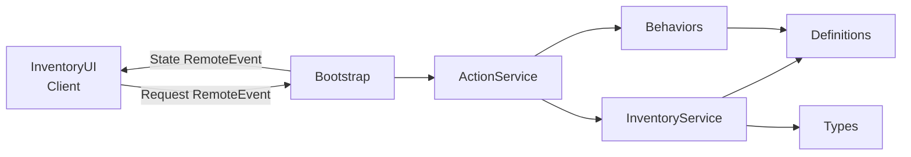

# Roblox Inventory System

A modular, server-authoritative inventory system for Roblox, written in **Luau**.

The project demonstrates client-server architecture, state management, typed Luau, modular programming and validation of multiplayer client requests.

It was created as a portfolio project and as a demonstration of how a gameplay system can be separated into independent, reusable components instead of being implemented in a single script.

## Demo

The included `RobloxProjectFile.rbxl` can be opened directly in Roblox Studio.

https://github.com/user-attachments/assets/70b61678-b304-499e-a753-d16d4912530f

## Features

The system currently supports:

- 5 hotbar slots and 10 backpack slots
- Item selection
- Hotbar keyboard shortcuts (`1`–`5`)
- Moving and swapping items between slots
- Automatic stack merging
- Maximum stack sizes
- Unique IDs for individual item instances
- Dropping items into the game world
- Picking up nearby dropped items
- Server-side pickup distance validation
- Dynamic item actions based on item capabilities
- Server-authoritative inventory state
- Client/server synchronization
- Basic RemoteEvent flood protection
- Runtime inventory and item-definition display

Several example items are included:

| Item | Capabilities |
|---|---|
| Apple | Consumable |
| Spear | Weapon, Throwable |
| Rifle | Weapon, Reloadable, Scoped |
| Hammer | Tool |

The capability system makes it possible to add new combinations of behaviors without writing item-specific logic throughout the inventory system.

## Architecture

The inventory is **server-authoritative**.

The client displays a local snapshot of the inventory, but it does not directly modify the authoritative inventory state.

When a player performs an action, the client sends a request to the server. The server validates the request, changes the inventory if the operation is valid, and sends the resulting state back to the client.



This design is important in a multiplayer environment because the player's client should not be trusted to directly modify gameplay-critical state.

## Project Structure

```text
roblox-inventory-system-demo/
│
├── RobloxProjectFile.rbxl
│
├── src/
│   ├── client/
│   │   └── InventoryUI.client.luau
│   │
│   ├── server/
│   │   ├── Bootstrap.server.luau
│   │   ├── InventoryService.luau
│   │   └── ActionService.luau
│   │
│   └── shared/
│       ├── Types.luau
│       ├── Definitions.luau
│       └── Behaviors.luau
│
└── README.md
```

### `InventoryService`

Owns the authoritative inventory state for each player.

Its responsibilities include:

- creating and removing player inventories;
- creating item instances with unique IDs;
- adding and removing items;
- calculating available inventory capacity;
- merging compatible item stacks;
- moving and swapping items;
- selecting inventory slots.

Before adding an item, the service calculates whether enough total capacity is available. This keeps pickup operations all-or-nothing instead of partially modifying the inventory when there is insufficient space.

### `ActionService`

Processes gameplay-related inventory requests.

It validates requests before executing them and handles operations such as:

- picking up world items;
- dropping items;
- moving items;
- executing item capabilities.

For world pickups, the server checks that the player's character is alive and close enough to the requested item.

Item instance IDs are also validated so that an outdated client request cannot accidentally operate on an item that has since moved to another slot.

### `Bootstrap`

Connects the inventory system to Roblox player lifecycle and networking.

It:

- creates an inventory when a player joins;
- removes player state when the player leaves;
- creates demonstration items;
- receives client requests;
- applies a small request-rate limit;
- sends updated state snapshots to clients.

### `Definitions`

Contains static item data.

For example, an item definition can specify:

- display name;
- description;
- weight;
- stackability;
- maximum stack size;
- damage;
- ammunition capacity;
- available capabilities.

The rest of the system does not need item-specific `if ItemId == ...` branches.

### `Behaviors`

Implements reusable item capabilities.

The current demo contains:

- `Consumable`
- `Weapon`
- `Reloadable`
- `Scoped`
- `Throwable`
- `Tool`

An item receives its available actions through its list of capabilities.

For example:

```text
Rifle
├── Weapon      → Fire
├── Reloadable  → Reload
└── Scoped      → Scope
```

The client can read these capabilities to display the appropriate actions, while the actual behavior is executed using server-owned state.

### `Types`

Defines the main data structures using Luau's type system.

The project runs in `--!strict` mode and defines types for:

- item definitions;
- runtime item instances;
- inventories;
- behavior contexts;
- item behaviors.

## Client-Server Flow

A typical inventory action follows this process:

```text
Player action
      │
      ▼
Inventory UI
      │
      │ Request
      ▼
Server
      │
      ├── Validate request
      ├── Validate slot
      ├── Validate item UniqueId
      ├── Validate player state
      └── Execute operation
      │
      ▼
Authoritative inventory state
      │
      │ Updated snapshot
      ▼
Client UI
```

The client therefore acts mainly as an input and presentation layer.

## Item Model

Static information and runtime information are intentionally kept separate.

An **item definition** describes what a type of item is:

```text
Rifle
├── MaxStack: 1
├── Damage: 25
├── MaxAmmo: 30
└── Capabilities:
    ├── Weapon
    ├── Reloadable
    └── Scoped
```

An **item instance** represents one concrete item inside an inventory:

```text
ItemId:   Rifle
UniqueId: <generated GUID>
Amount:   1
Ammo:     27
```

This allows multiple instances of the same item type to maintain independent runtime state.

## Security and Validation

Because Roblox games use a multiplayer client-server model, requests received from clients are treated as untrusted input.

The server performs validation before modifying inventory state, including:

- request type validation;
- slot validation;
- item ID validation;
- item instance / `UniqueId` validation;
- selected-item validation;
- character state validation;
- pickup-distance validation;
- capability validation;
- basic request-rate limiting.

The client never directly controls the authoritative inventory table.

## Technologies

**Luau**  
A language derived from Lua and used by Roblox. This project uses Luau's optional type system and strict type checking.

**Roblox Studio**  
Used for the game environment, user interface and multiplayer client/server runtime.

**Git / GitHub**  
Used for source control and project presentation.

## Running the Project

1. Install Roblox Studio.
2. Clone or download this repository.
3. Open `RobloxProjectFile.rbxl`.
4. Start the project using **Play**.
5. Use the inventory interface to select, move, drop and pick up items.
6. Use number keys `1`–`5` to select hotbar slots.

No external dependencies are required.

## Design Goals

The main goal of the project was not only to create a working inventory UI, but to keep gameplay logic structured and extendable.

The implementation focuses on:

- separation of responsibilities;
- reusable modules;
- typed data structures;
- server-authoritative gameplay;
- validation of network requests;
- data-driven item definitions;
- reusable behavior composition.

## Current Scope

This repository is intentionally a demonstration project rather than a complete production inventory framework.

Some actions such as weapon firing, scoping and building demonstrate the behavior architecture but do not implement complete combat or building systems.

Inventory persistence between sessions is also outside the current scope.

## Possible Future Improvements

Potential extensions include persistent inventory storage, automated tests, fully typed client-server request/response messages, drag-and-drop UI interaction, additional item properties, gameplay-specific action cooldowns and further separation of world-drop presentation from inventory logic.

## Author

Developed by [jafaad](https://github.com/jafaad) as a software development portfolio project.
